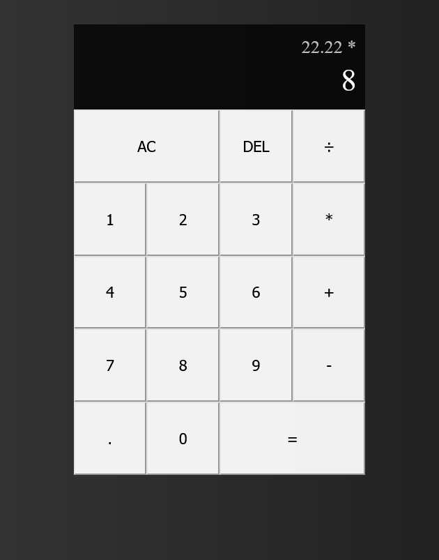

## **Getting Started**

***RUN***: 	npm install

***RUN***: 	npm run dev

## Project Structure

src/

    ├── components/

    ~~├── containers/~~

    ~~├── pages/~~

    ~~├── services/~~

    ~~├── utils/~~

    ├── styles/

    ~~├── assets/~~

    ~~├── constants/~~

    ~~├── contexts/~~

    ~~├── hooks/~~

    ~~├── redux/~~

    ~~├── routes/~~

├── app.js
└── main.js

1. **components/** : This folder contains reusable UI components that are used across the application. Each component should typically have its own folder with the component file (.js or .jsx) and any related files such as styles, tests, or subcomponents.
2. **containers/** : The containers folder contains components that are connected to the application state (using Redux, MobX, or other state management libraries) or handle business logic. These components are often responsible for fetching data from APIs and passing it down to child components.
3. **pages/** : This folder houses components that represent distinct pages/routes in your application. Each page component typically corresponds to a route defined in the routing system.
4. **services/** : The services folder contains modules responsible for making API requests and interacting with external services. These modules can encapsulate functions related to network calls, authentication, or any other service integration.
5. **utils/** : This folder is used for utility functions and helper modules that provide commonly used functionality across the application. Examples include date formatting, string manipulation, or validation functions.
6. **styles/** : In the styles folder, you can place global stylesheets (e.g., reset.css) or styling-related configuration files. It's also common to have styles folders within each component or page directory for component-specific styling.
7. **assets/** : This folder is used to store static assets such as images, fonts, or other media files used in the application.
8. **constants/** : In the constants folder, you can define application-level constants, configuration files, or enums that are shared across different parts of the codebase.
9. **contexts/** : The contexts folder is used for defining React contexts that provide shared state to components without explicitly passing it through props. Each context can have its own folder with the context file, related components, and tests.
10. **hooks/** : The hooks folder is used to store custom React hooks that encapsulate reusable logic or side effects.
11. **redux/** : If you are using Redux for state management, this folder is where you can organize your Redux-related files. It can include actions, reducers, selectors, and store configuration files.
12. **routes/** : This folder contains the routing configuration for your application, including the definition of routes, route guards, or navigation-related components.
13. **main.js** : The entry point of your application where you mount the root component and perform any necessary setup.

### Node.js

v18.16.0: [Download NODE.js](https://nodejs.org/en)

##### ⚛️React.jsx⚛️

v18.2.0: [Documentation](https://react.dev/reference/react)

##### ~~🚢TailwindCSS💨~~

~~v3.3.2: [Documentation](https://tailwindcss.com/)~~

##### ~~🌼DaisyUI📱~~

~~v3.1.6: [Documentation](https://daisyui.com/)~~

##### ⚒️Vite.js🧱

v4.3.9: [Documentation](https://vitejs.dev/guide/)
